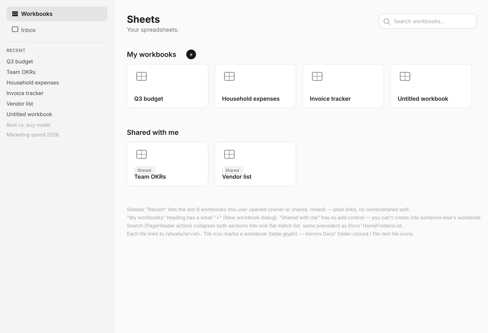
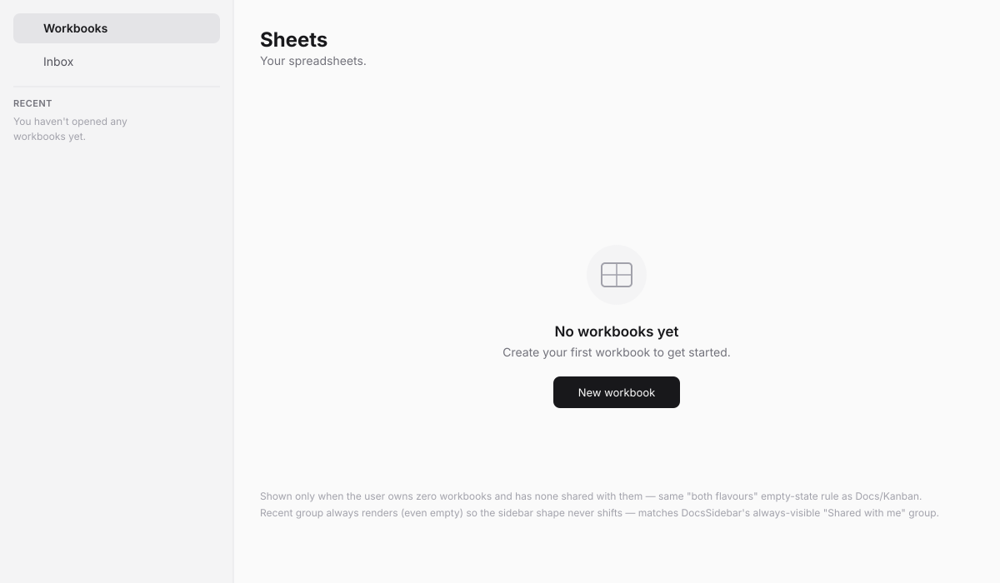
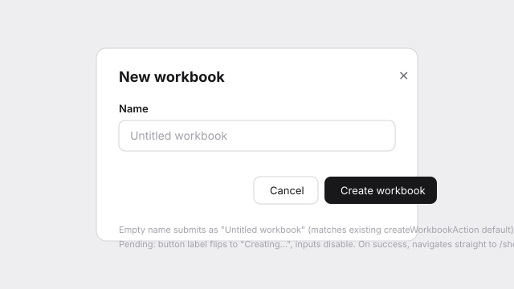
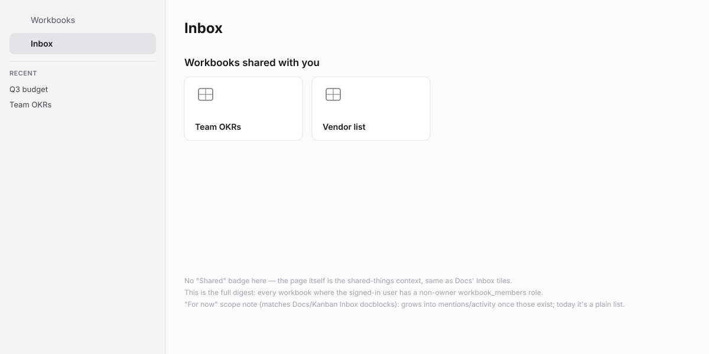
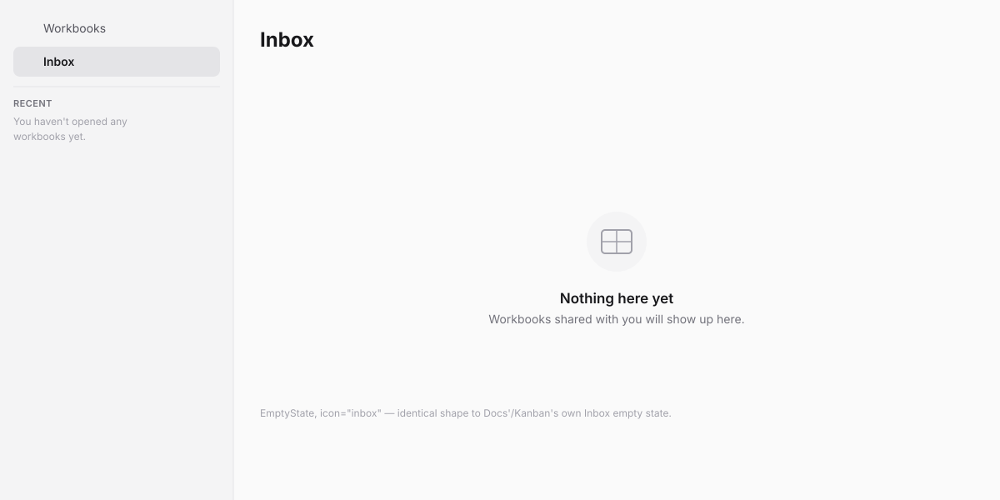
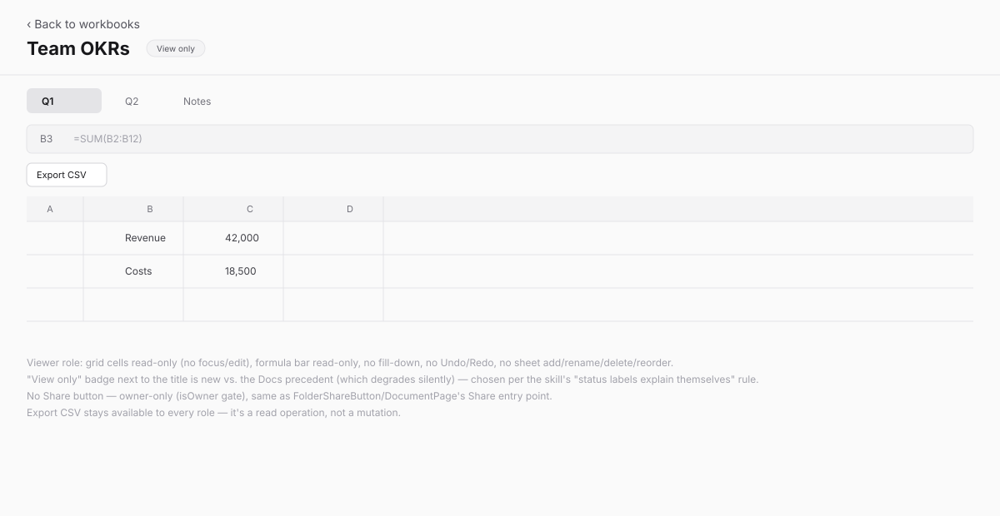

# Home redesign + workbook sharing (design spec)

> Wireframe-before-build spec per the `sv-ui-design` workflow. Wireframes in
> [`home-and-sharing/`](home-and-sharing/). Kept inside the plugin (not the
> platform's `docs/adhoc/`) because this plugin is externally-maintained.

## Problem

Sheets' entry point today (`app/page.tsx`) is a bare workbook list with an
inline create form — no persistent navigation, no way to discover work
shared with you, and (more fundamentally) no sharing model at all: every
`workbooks` action checks `ownerUserId` directly, and SPEC.md's MVP scope
explicitly deferred "sharing/permissions beyond single owner" to post-MVP.
We're redesigning the entry point to match the platform's established
multi-surface plugin shape (`ThreeColumnLayout`, same as Docs/Kanban), which
means building real workbook sharing as its foundation — a "Shared with me"
section and an Inbox digest are meaningless without it.

## Direction

`ThreeColumnLayout` with two columns (sidebar + main, no detail column).
Sidebar: **Workbooks** / **Inbox** nav (top, matches Docs'/Kanban's own nav
pair), divider, then a flat **Recent** list — the last 8 workbooks this user
opened, owner or shared mixed together (recency is about the user's own
access pattern, not ownership — unlike Docs/Kanban, which put "My X"/"Shared
with me" groups in the sidebar itself). That grouping instead lives in main
content: **My workbooks** then **Shared with me**, each a `CardTileGrid`,
mirroring `HomeFoldersList`. Workbook detail moves to `/sheets/w/[id]`,
outside the sidebar's route group — same split as Docs' Document editor and
Kanban's Board View, both of which live outside their own `(home)` layout.

Sharing is **workbook-level only** — a shared member gets access to every
sheet tab in that workbook. There's no per-sheet sharing (Sheets has no
nested-folder structure the way Docs does, so there's no "shared folder"
analogue to build beyond the workbook itself). Roles: `owner` / `editor` /
`viewer`, same three-role shape as `docs_folder_members` and
`kanban_project_members`. A viewer gets a fully read-only workbook: grid
cells, formula bar, and every sheet-tab/workbook mutation are disabled, and
the page carries a visible "View only" indicator (see Engineering notes for
why this deviates slightly from the Docs precedent).

## Jargon table

| Internal | User sees |
| --- | --- |
| plugin | app (never shown; page title is "Sheets") |
| `workbook_members` row | "shared with you" |
| `workbooks.ownerUserId` (creator) | never shown directly — the creator's role badge just reads "Owner", same as any other owner-role member |
| role `owner` / `editor` / `viewer` | "Owner" / "Editor" / "Viewer" — already plain English, shown verbatim in role badges and the role picker |
| `lastOpenedAt` | never shown as a field — it's ordering only, not a displayed timestamp |

## Screens

### 1. Home, populated — `home-and-sharing/01-home-populated.svg`

- Sidebar: **Workbooks** (active) / **Inbox**, divider, **Recent** (last 8
  opened, plain links, no icons — matches the muted, no-icon style of
  `DocsSidebar`'s group rows).
- `PageHeader` "Sheets" / "Your spreadsheets." with a search input as its
  `action` (search, not a toolbar button — same placement precedent as
  `HomeFoldersList`).
- "My workbooks" heading with a small "+" beside it (opens the New workbook
  dialog) — relocated from where Docs/Kanban put their "+" (next to the
  sidebar's "My Folders"/"My projects" group) since that group doesn't exist
  in this sidebar; the main-content heading is the natural anchor here.
- "Shared with me" heading, no add control — you can't create into someone
  else's workbook, same reasoning as Docs.
- Tiles: `CardTile variant="icon"`, a table-grid glyph, workbook name. Shared
  tiles additionally carry a "Shared" badge (mirrors `FolderTile`'s `shared`
  prop). Every tile links to `/sheets/w/<id>`.

### 2. Home, empty — `home-and-sharing/02-home-empty.svg`

`EmptyState`: "No workbooks yet" / "Create your first workbook to get
started." + one action. Shown only when the user owns zero workbooks **and**
has none shared with them (both-flavours rule, same as Docs/Kanban). Search
is suppressed on this state, matching `HomeFoldersList`. The sidebar's Recent
group still renders, with a muted "You haven't opened any workbooks yet."
caption, so the sidebar shape never shifts between empty and populated.

### 3. New workbook dialog — `home-and-sharing/03-new-workbook-dialog.svg`

Replaces the current bare inline form on `page.tsx` with a real dialog (same
upgrade Docs/Kanban already made with `CreateFolderDialog`/`NewProjectDialog`).
Name field, empty submits as "Untitled workbook" (existing default,
unchanged). Expected failures render inline via `useActionState`; pending
label "Creating…". On success, navigates straight to `/sheets/w/<id>`
(unchanged from today's `createWorkbookAction` behavior).

### 4. Inbox, populated — `home-and-sharing/04-inbox-populated.svg`

"Workbooks shared with you" — every workbook where the signed-in user holds
a non-owner `workbook_members` role. No "Shared" badge on these tiles (the
page itself is the shared-things context, matching Docs' Inbox tiles). Same
"for now" scope as Docs'/Kanban's own Inbox docblocks: a plain list today,
not a richer activity feed — there's no mentions/comments concept in Sheets
to feed one.

### 5. Inbox, empty — `home-and-sharing/05-inbox-empty.svg`

`EmptyState` icon `inbox`, "Nothing here yet" / "Workbooks shared with you
will show up here." Identical shape to Docs'/Kanban's own Inbox empty state.

### 6. Share dialog — `home-and-sharing/06-share-dialog.svg`

Owner-only (`isOwner` gate, opened from a "Share" button on the workbook
page). Member list (name/email, role badge, Remove) + invite form (directory
typeahead, role select defaulting to Viewer, "Add person"). This is close to
a line-for-line port of `FolderShareDialog`/`folder-sharing.ts` — same
structure, kept independently evolvable per that file's own precedent
comment, not a shared abstraction. Last remaining Owner can't be demoted or
removed (same rule).

### 7. Workbook page, viewer mode — `home-and-sharing/07-workbook-viewer-mode.svg`

Grid cells and formula bar are read-only, no fill-down, no Undo/Redo, no
sheet-tab add/rename/delete/reorder, no Delete workbook, no Share button
(owner-only). Export CSV stays available to every role — it's a read
operation. A small "View only" badge sits next to the title.

**Deviation from the Docs precedent, called out explicitly:** `DocumentPage`
degrades silently for a viewer (no mode toggle, fields just become
`readOnly`, no visible label saying why). This spec adds an explicit "View
only" indicator instead, per the `sv-ui-design` skill's own "status labels
explain themselves" principle — a viewer should know why they can't edit,
not discover it by fields not responding. Flagged as a real choice, not an
oversight, in case the developer prefers matching Docs' silent-degrade
precedent exactly instead.

## States checklist

- **Empty:** screens 2 and 5 (workbooks-empty, inbox-empty).
- **Populated:** screens 1 and 4.
- **Degraded / mode:** screen 7 (viewer role) — the one genuinely new "mode"
  this feature introduces.
- **Pending:** dialog buttons flip label + disable inputs (New workbook,
  Share's invite form).
- **Error (expected):** inline in dialogs via `ActionResult`, input
  preserved.
- **Error (unexpected):** `app/error.tsx` already exists in this plugin
  (added in an earlier task) — no new boundary needed, just confirm it still
  covers the new routes.

## Engineering notes

- **New `workbook_members` table**, shaped like `docs_folder_members`:
  `(workbookId, userId, tenantId, role enum('owner','editor','viewer'),
  invitedBy, joinedAt, lastOpenedAt)`, composite PK on `(workbookId, userId)`.
  `createWorkbookAction` seeds an `owner` row for the creator alongside the
  existing `workbooks` insert. `workbooks.ownerUserId` is unchanged and stays
  as the creator record; access control moves entirely to membership.
- **`lastOpenedAt` lives on `workbook_members`, per (workbook, user) — not
  on `workbooks` itself.** A workbook is shared, so "recently opened" has to
  track each member's own access, not whichever member opened it most
  recently instance-wide. (First pass put this column on `workbooks`
  directly; live-testing the invited-viewer flow caught the bug immediately
  — a workbook the owner had opened showed up in the invited viewer's own
  Recent list before they'd ever opened it themselves. Fixed by moving the
  column and updating `getWorkbook()`/`listRecentWorkbooks()` accordingly —
  see migration `0002_black_ricochet.sql`.) Sidebar Recent queries the 8
  most-recent by this per-user column, across every workbook the user has
  any membership row for (owner or shared) — not filtered to owned-only.
- **`resolveWorkbookRole(db, tenantId, userId, workbookId)` helper**
  (mirrors `resolveFolderRole`) replaces the current
  `eq(workbooks.ownerUserId, session.user.id)` check in every action in
  `app/actions.ts`. Read actions (`getWorkbook`, `getFinanceRatesAction`)
  require any role; write actions (`saveSheetCellsAction`, `addSheetAction`,
  `renameSheetAction`, `deleteSheetAction`, `reorderSheetsAction`,
  `setActiveSheetAction`) require `owner`/`editor`; `deleteWorkbookAction`
  and the new share-management actions require `owner`.
- **`WorkbookView` gains `canEdit`/`isOwner` props**, threaded down to
  `SheetGrid`/`SheetTabs`/`FormulaBar` — same prop shape as `DocumentPage`.
  `SheetGrid`'s cell `<input>`s and the formula bar's `CodeTextarea` get
  `readOnly={!canEdit}`; Undo/Redo, Delete workbook, and every `SheetTabs`
  mutation control render conditionally on `canEdit`; the Share button
  renders conditionally on `isOwner`.
- **Route move:** `app/[workbookId]/` → `app/w/[workbookId]/`. New
  `app/(home)/layout.tsx` wraps `app/(home)/page.tsx` (Workbooks) and
  `app/(home)/inbox/page.tsx` in `ThreeColumnLayout` + a new `SheetsSidebar`
  component. `app/w/[workbookId]/` sits outside `(home)`, unchanged
  otherwise. No redirect from the old `/sheets/[id]` path — this is a
  `.local` dev plugin with no external installs to preserve links for.
- **New manifest permission: `notifications:send`** — in-app "shared a
  workbook with you" notification on invite, matching Kanban's pattern
  (`kanban_project_members` + `notifications:send`, no email). Flagged as an
  open question below on whether to also add `mailer:send` (Docs' fuller
  pattern) or stay in-app-only (Kanban's, smaller surface).
- **`sdk.directory.searchUsers`/`resolveUsers`** for the member picker — no
  extra manifest permission needed (neither Docs' nor Kanban's manifest
  declares one for it).
- **DS gap check: no gap.** `ThreeColumnLayout`, `Dialog`, `FormField`,
  `Input`, `Select`, `Button`, `Spinner`, `StatusBadge`, `CardTile`,
  `CardTileGrid`, `EmptyState`, `PageHeader`, `Icon`, `Typography` all
  already exist in `@sovereignfs/ui` and cover every control this needs.
- **Mobile:** web-first, matching Kanban's K.4 precedent — `ThreeColumnLayout`
  has no responsive behavior of its own by design (its own docblock says so).
  A full mobile layout is out of scope here and must not be blocked by
  anything in this spec.

## Open questions

1. ~~Email invites (`mailer:send`) alongside the in-app notification, or
   in-app only?~~ **Resolved: in-app only.** Just `notifications:send`,
   matching Kanban. `mailer:send` can be added later without a data-model
   change if wanted.
2. ~~Does "Recent" include shared workbooks too, or owner-only?~~ Resolved in
   the clarifying-question pass: recency tracks the user's own access
   (owner or shared, mixed).
3. **Live-kick on member removal?** If an editor/viewer currently has a
   workbook open when their access is revoked, nothing evicts them
   mid-session — the change takes effect on next load. Same precedent as
   Docs/Kanban (neither solves this either); not re-litigating it here.
4. ~~"View only" badge vs. Docs' silent degrade~~ **Resolved: explicit
   badge.** See screen 7.

## Phasing

Sequenced as two internal build/verify phases (Home redesign, then Workbook
sharing — see Engineering notes for what belongs to each), but **landing as
one combined PR/roadmap task**, not split across two — both phases ship
together.
